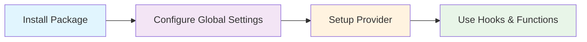
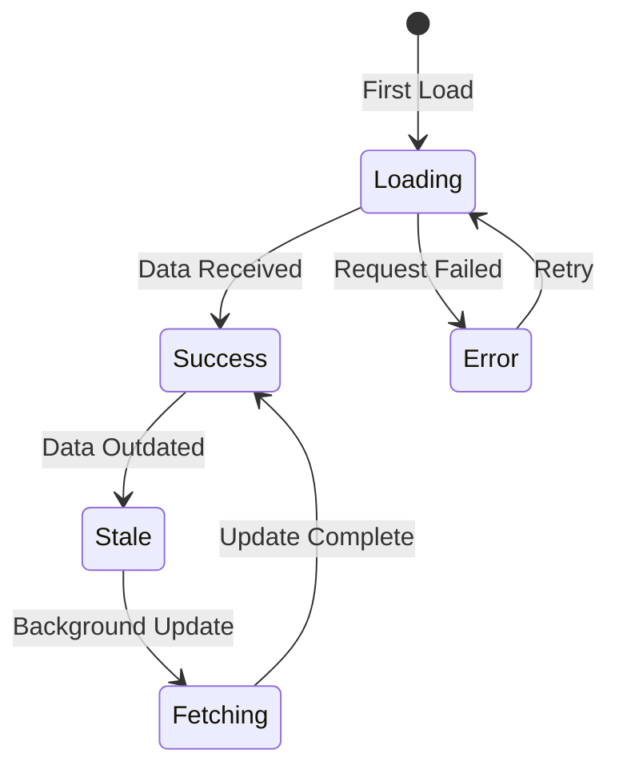
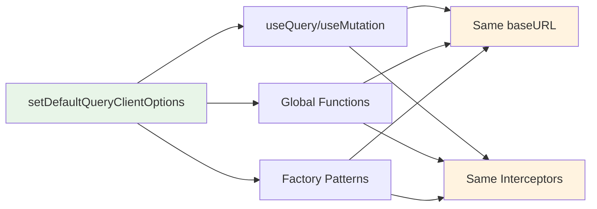
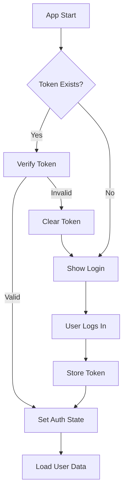

# Next Unified Query User Guide

> 🚀 A complete guide to building modern React applications with Next Unified Query - the high-performance HTTP client and state management library.

## 📚 Table of Contents

- [Getting Started](#getting-started)
- [Core Concepts](#core-concepts)
- [Step-by-Step Tutorials](#step-by-step-tutorials)
- [Common Patterns](#common-patterns)
- [Best Practices](#best-practices)
- [Troubleshooting](#troubleshooting)
- [FAQ](#faq)

## 🚀 Getting Started

### What is Next Unified Query?

Next Unified Query is a modern HTTP client and state management library designed specifically for React applications. It combines the best features of libraries like TanStack Query and Axios while providing:

- ⚡ **Lightning Fast**: Optimized rendering with 99% fewer re-renders
- 🛡️ **Type Safe**: Full TypeScript support with automatic type inference
- 📦 **Small Bundle**: Only 29KB gzipped
- 🔄 **Smart Caching**: Intelligent cache management with LRU eviction
- 🌐 **SSR Ready**: Built-in server-side rendering support

### Installation

```bash
npm install next-unified-query
```

That's it! The core package is automatically included.

### Quick Setup



**🔧 Key Features You'll Get:**
- ✅ **자동 baseURL 적용**: 모든 요청에 baseURL이 자동으로 적용됩니다
- ✅ **통합 설정 관리**: React 훅과 전역 함수가 동일한 설정을 공유합니다
- ✅ **타입 안전성**: 완전한 TypeScript 지원과 스키마 검증
- ✅ **SSR 지원**: Next.js App Router와 완벽하게 호환됩니다

**Step 1: Configure Global Settings**

Next.js에서는 서버와 클라이언트 모두에서 설정이 필요합니다. 한 번 설정하면 모든 요청 방식(useQuery, useMutation, 전역 함수)에 자동으로 적용됩니다.

```tsx
// app/layout.tsx (서버사이드)
import { setDefaultQueryClientOptions } from 'next-unified-query';
import { ClientProvider } from './client-provider';

// 🌟 전역 설정 - 모든 요청 방식에 적용됨
setDefaultQueryClientOptions({
  baseURL: process.env.NEXT_PUBLIC_API_URL || 'http://localhost:3002/api',
  timeout: 10000,
  queryCache: {
    maxQueries: 1000,
    gcTime: 5 * 60 * 1000, // 5분
  },
  headers: {
    'Content-Type': 'application/json',
    'X-Client-Version': '1.0.0'
  },
  // 🔄 인터셉터도 모든 요청에 적용
  interceptors: [
    {
      request: async (config) => {
        // 인증 토큰 자동 추가 등
        return config;
      }
    }
  ]
});

export default function RootLayout({
  children,
}: {
  children: React.ReactNode;
}) {
  return (
    <html lang="en">
      <body>
        <ClientProvider>{children}</ClientProvider>
      </body>
    </html>
  );
}
```

**Step 2: Client Provider Setup**

클라이언트에서도 동일한 설정을 해야 SSR 데이터와 일관성을 유지할 수 있습니다.

```tsx
// app/client-provider.tsx (클라이언트사이드)
"use client";

import { setDefaultQueryClientOptions } from 'next-unified-query';
import { QueryClientProvider } from 'next-unified-query/react';

// 🔄 서버와 동일한 설정 필요 (환경변수는 자동으로 동기화됨)
setDefaultQueryClientOptions({
  baseURL: process.env.NEXT_PUBLIC_API_URL || 'http://localhost:3002/api',
  timeout: 10000,
  queryCache: {
    maxQueries: 1000,
    gcTime: 5 * 60 * 1000,
  },
  headers: {
    'Content-Type': 'application/json',
    'X-Client-Version': '1.0.0'
  }
});

export function ClientProvider({ children }: { children: React.ReactNode }) {
  return <QueryClientProvider>{children}</QueryClientProvider>;
}
```

**Step 3: Start Using All Request Methods**

이제 모든 요청 방식이 baseURL을 자동으로 사용합니다:

```tsx
// app/users/page.tsx
import { useQuery, useMutation } from 'next-unified-query/react';
import { post, get } from 'next-unified-query';

export default function UsersPage() {
  // 🔄 useQuery - baseURL 자동 적용
  const { data, isLoading } = useQuery({
    cacheKey: ['users'],
    url: '/users'  // ✅ http://localhost:3002/api/users로 요청
  });

  // 🔄 useMutation - baseURL 자동 적용  
  const createUserMutation = useMutation({
    url: '/users',     // ✅ http://localhost:3002/api/users로 요청
    method: 'POST'
  });

  // 🔄 전역 함수들도 baseURL 자동 적용
  const handleDirectApiCall = async () => {
    const user = await get('/users/1');     // ✅ 자동 baseURL 적용
    const newUser = await post('/users', {  // ✅ 자동 baseURL 적용
      name: 'New User',
      email: 'user@example.com'
    });
  };

  if (isLoading) return <div>Loading...</div>;

  return (
    <div>
      <ul>
        {data?.map(user => (
          <li key={user.id}>{user.name}</li>
        ))}
      </ul>
      
      <button 
        onClick={() => createUserMutation.mutate({ 
          name: 'John', 
          email: 'john@example.com' 
        })}
      >
        Add User
      </button>
    </div>
  );
}
```

**🎉 완료! 이제 다음을 얻었습니다:**

✅ **일관된 API 호출**: 모든 요청이 동일한 baseURL과 설정을 사용  
✅ **타입 안전성**: 컴파일 타임에 오류 감지  
✅ **자동 캐싱**: 중복 요청 방지와 성능 최적화  
✅ **SSR 지원**: 서버에서 미리 데이터를 가져와 빠른 로딩  
✅ **개발자 경험**: 간단한 설정으로 강력한 기능

## 🧠 Core Concepts

### Data Flow Architecture

```mermaid
graph TB
    subgraph "React Layer"
        A[useQuery<br/>GET/HEAD only] --> B[useMutation<br/>POST/PUT/DELETE/etc]
        C[Factory Patterns<br/>Type-safe APIs]
    end
    
    subgraph "Global Functions Layer"
        D[get(), post(), put()<br/>delete(), patch()]
        E[Unified Configuration<br/>baseURL + interceptors]
    end
    
    subgraph "Query Client Layer"
        F[Query Observer] --> G[Query Cache<br/>LRU + GC]
        H[Mutation Manager] --> G
        I[Configuration Manager<br/>setDefaultQueryClientOptions]
    end
    
    subgraph "Network Layer"
        J[HTTP Client] --> K[Interceptors<br/>Request/Response/Error]
        K --> L[API Server]
    end
    
    A --> F
    B --> H
    C --> F
    C --> H
    D --> J
    E --> K
    I --> E
    I --> J
    F --> J
    H --> J
    
    style A fill:#e3f2fd
    style B fill:#e3f2fd
    style C fill:#e1f5fe
    style D fill:#f3e5f5
    style E fill:#fff3e0
    style F fill:#f3e5f5
    style G fill:#fff3e0
    style H fill:#f3e5f5
    style I fill:#e8f5e8
    style J fill:#e8f5e8
```

### Key Concepts

#### 1. **Cache Keys**
Unique identifiers for your data:

```tsx
// Simple key
cacheKey: ['users']

// Parameterized key
cacheKey: ['user', userId]

// Complex key
cacheKey: ['posts', { userId, status: 'published' }]
```

#### 2. **Query States**
Your data can be in different states:



#### 3. **Automatic Re-rendering**
Components only re-render when the data they actually use changes:

```tsx
// ✅ Only re-renders when 'data' changes
const { data } = useQuery({ ... });

// ❌ Re-renders on any state change
const result = useQuery({ ... });
```

#### 4. **Unified Configuration System**
한 번 설정하면 모든 요청 방식에 자동으로 적용됩니다:

```tsx
// 전역 설정 한 번만
setDefaultQueryClientOptions({
  baseURL: 'https://api.example.com',
  headers: { 'Authorization': 'Bearer token' }
});

// ✅ 모든 방식이 자동으로 baseURL 사용
const { data } = useQuery({ url: '/users' });        // 🔄 자동 적용
const mutation = useMutation({ url: '/users' });     // 🔄 자동 적용  
const response = await post('/users', data);         // 🔄 자동 적용
```

#### 5. **HTTP Method Type Safety**
요청 목적에 따른 엄격한 타입 분리로 실수를 방지합니다:

```tsx
// ✅ 데이터 조회 - GET/HEAD만 허용
const { data } = useQuery({
  cacheKey: ['users'],
  url: '/users'  // GET 메서드 (기본값)
});

// ✅ 데이터 변경 - POST/PUT/DELETE/PATCH 허용
const mutation = useMutation({
  url: '/users',
  method: 'POST'  // GET 제외한 모든 메서드
});

// ❌ 컴파일 오류 - useQuery는 POST 지원 안함
const query = useQuery({
  url: '/users',
  method: 'POST'  // TypeScript 오류!
});
```

#### 6. **Factory Pattern Integration**
타입 안전한 API 정의와 재사용 가능한 구조:

```tsx
// 쿼리 팩토리 - 데이터 조회용
const userQueries = createQueryFactory({
  list: {
    cacheKey: () => ['users'] as const,
    url: () => '/users'
  },
  get: {
    cacheKey: (id: number) => ['users', id] as const,
    url: (id: number) => `/users/${id}`
  }
});

// 뮤테이션 팩토리 - 데이터 변경용
const userMutations = createMutationFactory({
  create: {
    url: () => '/users',
    method: 'POST'
  }
});

// 사용할 때도 타입 안전
const { data } = useQuery(userQueries.list);           // ✅ 타입 추론
const mutation = useMutation(userMutations.create);    // ✅ 타입 추론
```

#### 7. **Smart Caching & Performance**
지능적인 캐싱으로 불필요한 요청과 리렌더링을 방지:

```tsx
// 동일한 캐시 키 = 캐시된 데이터 재사용
function UserProfile({ userId }: { userId: number }) {
  const { data } = useQuery({
    cacheKey: ['user', userId],
    url: `/users/${userId}`
  });
  // 이미 로드된 사용자는 즉시 표시 ⚡
}

function UsersList() {
  const { data } = useQuery({
    cacheKey: ['user', 1],  // 동일한 캐시 키
    url: '/users/1'
  });
  // 캐시에서 즉시 데이터 가져옴 ⚡
}
```

#### 8. **Global Functions Synchronization**
전역 함수들이 QueryClient 설정과 완전히 동기화됩니다:



```tsx
// 설정 한 번
setDefaultQueryClientOptions({
  baseURL: 'https://api.example.com',
  interceptors: [authInterceptor]
});

// 🔄 모든 요청이 동일한 설정 사용
const { data } = useQuery({ url: '/users' });      // 인터셉터 + baseURL
const response = await get('/users');               // 인터셉터 + baseURL  
const mutation = useMutation({ url: '/users' });   // 인터셉터 + baseURL
```

## 📖 Step-by-Step Tutorials

### Tutorial 1: Building a Todo App

Let's build a complete Todo application step by step.

#### Step 1: Set Up the Project Structure

```
src/
├── app/
│   ├── layout.tsx
│   ├── page.tsx
│   └── providers.tsx
├── components/
│   ├── TodoList.tsx
│   ├── TodoItem.tsx
│   └── AddTodo.tsx
└── lib/
    └── queries.ts
```

#### Step 2: Define Your Queries

```tsx
// lib/queries.ts
import { createQueryFactory, createMutationFactory, z } from 'next-unified-query';

// Define schemas for type safety
const todoSchema = z.object({
  id: z.number(),
  title: z.string(),
  completed: z.boolean(),
  createdAt: z.string()
});

const createTodoSchema = todoSchema.omit({ id: true, createdAt: true });

// Create query factory
export const todoQueries = createQueryFactory({
  list: {
    cacheKey: () => ['todos'] as const,
    url: () => '/api/todos',
    schema: z.array(todoSchema)
  },
  
  get: {
    cacheKey: (id: number) => ['todos', id] as const,
    url: (id: number) => `/api/todos/${id}`,
    schema: todoSchema
  }
});

// Create mutation factory
export const todoMutations = createMutationFactory({
  create: {
    url: () => '/api/todos',
    method: 'POST',
    requestSchema: createTodoSchema,
    responseSchema: todoSchema
  },
  
  update: {
    url: ({ id }: { id: number }) => `/api/todos/${id}`,
    method: 'PUT',
    requestSchema: todoSchema,
    responseSchema: todoSchema
  },
  
  delete: {
    url: (id: number) => `/api/todos/${id}`,
    method: 'DELETE'
  }
});
```

#### Step 3: Build the Todo List Component

```tsx
// components/TodoList.tsx
import { useQuery } from 'next-unified-query/react';
import { todoQueries } from '@/lib/queries';
import { TodoItem } from './TodoItem';

export function TodoList() {
  const { data: todos, isLoading, error } = useQuery(todoQueries.list);

  if (isLoading) {
    return (
      <div className="animate-pulse">
        {[...Array(3)].map((_, i) => (
          <div key={i} className="h-12 bg-gray-200 rounded mb-2" />
        ))}
      </div>
    );
  }

  if (error) {
    return (
      <div className="text-red-500 p-4 border border-red-200 rounded">
        Error loading todos: {error.message}
      </div>
    );
  }

  return (
    <div className="space-y-2">
      {todos?.length === 0 ? (
        <p className="text-gray-500 text-center py-8">
          No todos yet. Add one above!
        </p>
      ) : (
        todos?.map(todo => (
          <TodoItem key={todo.id} todo={todo} />
        ))
      )}
    </div>
  );
}
```

#### Step 4: Create Todo Item with Optimistic Updates

```tsx
// components/TodoItem.tsx
import { useMutation, useQueryClient } from 'next-unified-query/react';
import { todoMutations } from '@/lib/queries';

interface TodoItemProps {
  todo: {
    id: number;
    title: string;
    completed: boolean;
  };
}

export function TodoItem({ todo }: TodoItemProps) {
  const queryClient = useQueryClient();

  const updateMutation = useMutation({
    ...todoMutations.update,
    onMutate: async (newTodo) => {
      // Cancel any outgoing refetches
      await queryClient.cancelQueries(['todos']);

      // Snapshot the previous value
      const previousTodos = queryClient.get(['todos']);

      // Optimistically update to the new value
      queryClient.setQueryData(['todos'], (old) =>
        old?.map(t => t.id === todo.id ? { ...t, ...newTodo } : t)
      );

      return { previousTodos };
    },
    onError: (err, newTodo, context) => {
      // Rollback on error
      if (context?.previousTodos) {
        queryClient.setQueryData(['todos'], context.previousTodos);
      }
    },
    onSettled: () => {
      // Always refetch after error or success
      queryClient.invalidateQueries([['todos']]);
    }
  });

  const deleteMutation = useMutation({
    ...todoMutations.delete,
    onSuccess: () => {
      // Remove from cache
      queryClient.setQueryData(['todos'], (old) =>
        old?.filter(t => t.id !== todo.id)
      );
    }
  });

  const toggleComplete = () => {
    updateMutation.mutate({
      id: todo.id,
      title: todo.title,
      completed: !todo.completed
    });
  };

  return (
    <div className="flex items-center gap-3 p-3 border rounded hover:bg-gray-50">
      <input
        type="checkbox"
        checked={todo.completed}
        onChange={toggleComplete}
        disabled={updateMutation.isPending}
        className="w-4 h-4"
      />
      
      <span className={`flex-1 ${todo.completed ? 'line-through text-gray-500' : ''}`}>
        {todo.title}
      </span>
      
      <button
        onClick={() => deleteMutation.mutate(todo.id)}
        disabled={deleteMutation.isPending}
        className="text-red-500 hover:text-red-700 px-2 py-1"
      >
        {deleteMutation.isPending ? 'Deleting...' : 'Delete'}
      </button>
    </div>
  );
}
```

#### Step 5: Add Todo Form

```tsx
// components/AddTodo.tsx
import { useState } from 'react';
import { useMutation, useQueryClient } from 'next-unified-query/react';
import { todoMutations } from '@/lib/queries';

export function AddTodo() {
  const [title, setTitle] = useState('');
  const queryClient = useQueryClient();

  const createMutation = useMutation({
    ...todoMutations.create,
    onSuccess: (newTodo) => {
      // Add to cache
      queryClient.setQueryData(['todos'], (old = []) => [...old, newTodo]);
      setTitle(''); // Reset form
    }
  });

  const handleSubmit = (e: React.FormEvent) => {
    e.preventDefault();
    if (title.trim()) {
      createMutation.mutate({
        title: title.trim(),
        completed: false
      });
    }
  };

  return (
    <form onSubmit={handleSubmit} className="mb-6">
      <div className="flex gap-2">
        <input
          type="text"
          value={title}
          onChange={(e) => setTitle(e.target.value)}
          placeholder="Add a new todo..."
          className="flex-1 px-3 py-2 border rounded focus:outline-none focus:ring-2 focus:ring-blue-500"
          disabled={createMutation.isPending}
        />
        <button
          type="submit"
          disabled={createMutation.isPending || !title.trim()}
          className="px-4 py-2 bg-blue-500 text-white rounded hover:bg-blue-600 disabled:opacity-50"
        >
          {createMutation.isPending ? 'Adding...' : 'Add'}
        </button>
      </div>
      
      {createMutation.error && (
        <p className="text-red-500 text-sm mt-2">
          Error: {createMutation.error.message}
        </p>
      )}
    </form>
  );
}
```

#### Step 6: Put It All Together

```tsx
// app/page.tsx
import { AddTodo } from '@/components/AddTodo';
import { TodoList } from '@/components/TodoList';

export default function HomePage() {
  return (
    <div className="max-w-md mx-auto mt-8 p-6">
      <h1 className="text-2xl font-bold mb-6">My Todo App</h1>
      <AddTodo />
      <TodoList />
    </div>
  );
}
```

### Tutorial 2: User Authentication Flow

#### Authentication State Management



```tsx
// lib/auth.ts
import { createQueryFactory, createMutationFactory } from 'next-unified-query';

export const authQueries = createQueryFactory({
  me: {
    cacheKey: () => ['auth', 'me'] as const,
    url: () => '/api/auth/me',
    enabled: () => !!localStorage.getItem('token')
  }
});

export const authMutations = createMutationFactory({
  login: {
    url: () => '/api/auth/login',
    method: 'POST'
  },
  
  logout: {
    mutationFn: async () => {
      localStorage.removeItem('token');
      return { success: true };
    }
  }
});

// components/AuthProvider.tsx
export function AuthProvider({ children }: { children: React.ReactNode }) {
  const queryClient = useQueryClient();
  const { data: user, isLoading } = useQuery(authQueries.me);

  const logoutMutation = useMutation({
    ...authMutations.logout,
    onSuccess: () => {
      queryClient.clear(); // Clear all cache on logout
      queryClient.invalidateQueries([['auth']]);
    }
  });

  if (isLoading) {
    return <div>Loading...</div>;
  }

  return (
    <AuthContext.Provider value={{ user, logout: logoutMutation.mutate }}>
      {children}
    </AuthContext.Provider>
  );
}
```

## 🔄 Common Patterns

### Pattern 1: Dependent Queries

Sometimes you need to fetch data based on other data:

```tsx
function UserPosts({ userId }: { userId: number }) {
  // First query: Get user
  const { data: user } = useQuery({
    cacheKey: ['user', userId],
    url: `/api/users/${userId}`
  });

  // Second query: Get user's posts (depends on user data)
  const { data: posts } = useQuery({
    cacheKey: ['posts', 'user', userId],
    url: `/api/posts?userId=${userId}`,
    enabled: !!user // Only run when user data is available
  });

  return (
    <div>
      <h2>{user?.name}'s Posts</h2>
      {posts?.map(post => (
        <div key={post.id}>{post.title}</div>
      ))}
    </div>
  );
}
```

### Pattern 2: Infinite Scrolling

```tsx
function InfinitePostList() {
  const [pages, setPages] = useState([0]);
  
  const queries = pages.map(page => 
    useQuery({
      cacheKey: ['posts', 'page', page],
      url: `/api/posts?page=${page}&limit=10`
    })
  );

  const allPosts = queries.flatMap(q => q.data?.posts || []);
  const hasMore = queries[queries.length - 1]?.data?.hasMore;
  const isLoadingMore = queries[queries.length - 1]?.isFetching;

  const loadMore = () => {
    if (hasMore && !isLoadingMore) {
      setPages(prev => [...prev, prev.length]);
    }
  };

  return (
    <div>
      {allPosts.map(post => (
        <PostCard key={post.id} post={post} />
      ))}
      
      {hasMore && (
        <button onClick={loadMore} disabled={isLoadingMore}>
          {isLoadingMore ? 'Loading...' : 'Load More'}
        </button>
      )}
    </div>
  );
}
```

### Pattern 3: Real-time Updates

```tsx
function useRealtimeQuery(queryKey: string[], url: string) {
  const queryClient = useQueryClient();
  const query = useQuery({ cacheKey: queryKey, url });

  useEffect(() => {
    const eventSource = new EventSource(`${url}/stream`);
    
    eventSource.onmessage = (event) => {
      const newData = JSON.parse(event.data);
      queryClient.setQueryData(queryKey, newData);
    };

    return () => eventSource.close();
  }, [queryKey, url, queryClient]);

  return query;
}

// Usage
function LiveDashboard() {
  const { data } = useRealtimeQuery(['dashboard'], '/api/dashboard');
  
  return <div>Live data: {JSON.stringify(data)}</div>;
}
```

## ✨ Best Practices

### 1. Query Key Naming

```tsx
// ✅ Good: Hierarchical and descriptive
['users']                    // All users
['users', userId]           // Specific user
['users', userId, 'posts']  // User's posts
['posts', { status: 'published', limit: 10 }] // Filtered posts

// ❌ Bad: Flat and unclear
['userList']
['userData123']
['publishedPosts10']
```

### 2. Error Handling

```tsx
// ✅ Good: Comprehensive error handling
function UserProfile({ userId }: { userId: number }) {
  const { data, isLoading, error, refetch } = useQuery({
    cacheKey: ['user', userId],
    url: `/api/users/${userId}`
  });

  if (isLoading) return <Spinner />;
  
  if (error) {
    return (
      <ErrorBoundary>
        <div className="error-container">
          <h3>Something went wrong</h3>
          <p>{error.message}</p>
          <button onClick={() => refetch()}>Try Again</button>
        </div>
      </ErrorBoundary>
    );
  }

  return <div>{data?.name}</div>;
}
```

### 3. Loading States

```tsx
// ✅ Good: Contextual loading states
function ProductList() {
  const { data, isLoading, isFetching } = useQuery({
    cacheKey: ['products'],
    url: '/api/products'
  });

  return (
    <div>
      <div className="header">
        <h2>Products</h2>
        {isFetching && <Spinner size="small" />}
      </div>
      
      {isLoading ? (
        <ProductListSkeleton />
      ) : (
        <div>
          {data?.map(product => (
            <ProductCard key={product.id} product={product} />
          ))}
        </div>
      )}
    </div>
  );
}
```

### 4. Cache Management

```tsx
// ✅ Good: Strategic cache invalidation
const updateUserMutation = useMutation({
  mutationFn: updateUser,
  onSuccess: (updatedUser) => {
    // Update specific user
    queryClient.setQueryData(['user', updatedUser.id], updatedUser);
    
    // Invalidate related queries
    queryClient.invalidateQueries([['users']]); // User list
    queryClient.invalidateQueries([['posts', 'user', updatedUser.id]]); // User's posts
  }
});
```

### 5. baseURL Configuration Best Practices

중앙집중식 설정으로 일관성과 유지보수성을 높이세요:

```tsx
// ✅ Good: 환경별 설정 분리
// config/api.ts
const API_CONFIG = {
  development: {
    baseURL: 'http://localhost:3002/api',
    timeout: 10000,
  },
  production: {
    baseURL: 'https://api.example.com',
    timeout: 15000,
  }
};

export const getApiConfig = () => {
  const env = process.env.NODE_ENV as keyof typeof API_CONFIG;
  return API_CONFIG[env] || API_CONFIG.development;
};

// app/layout.tsx
setDefaultQueryClientOptions({
  ...getApiConfig(),
  headers: {
    'Content-Type': 'application/json',
    'X-Client-Version': process.env.npm_package_version || '1.0.0'
  }
});

// ❌ Bad: 하드코딩된 URL들
const { data } = useQuery({
  url: 'http://localhost:3002/api/users'  // 환경별 변경 어려움
});
```

### 6. HTTP Method 선택 가이드

올바른 메서드 선택으로 의도를 명확히 하세요:

```tsx
// ✅ Good: 명확한 목적 분리
// 데이터 조회 - useQuery 사용
const { data: users } = useQuery({
  cacheKey: ['users'],
  url: '/users'  // GET 요청 (자동)
});

// 데이터 생성 - useMutation 사용
const createUser = useMutation({
  url: '/users',
  method: 'POST'  // 명시적 POST
});

// 직접 API 호출 - 전역 함수 사용
const handleExport = async () => {
  const csvData = await get('/users/export');     // GET - 데이터 가져오기
  await post('/analytics', { action: 'export' }); // POST - 이벤트 기록
};

// ❌ Bad: 목적에 맞지 않는 사용
const result = useMutation({
  url: '/users',
  method: 'GET'  // useMutation에서 GET 사용은 안티패턴
});
```

### 7. Factory Pattern 활용

타입 안전성과 재사용성을 높이는 Factory 패턴:

```tsx
// ✅ Good: 체계적인 Factory 구조
// api/users.ts
export const userQueries = createQueryFactory({
  // 목록 조회
  list: {
    cacheKey: (filters?: UserFilters) => ['users', filters] as const,
    url: (filters?: UserFilters) => {
      const params = new URLSearchParams(filters);
      return `/users?${params}`;
    },
    schema: z.array(userSchema)
  },
  
  // 단일 사용자 조회
  get: {
    cacheKey: (id: number) => ['users', id] as const,
    url: (id: number) => `/users/${id}`,
    schema: userSchema
  },
  
  // 복잡한 조회 (Custom Function)
  dashboard: {
    cacheKey: (userId: number) => ['users', userId, 'dashboard'] as const,
    queryFn: async (userId: number, fetcher) => {
      const [user, stats, activities] = await Promise.all([
        fetcher.get(`/users/${userId}`),
        fetcher.get(`/users/${userId}/stats`),
        fetcher.get(`/users/${userId}/activities`)
      ]);
      return { user: user.data, stats: stats.data, activities: activities.data };
    }
  }
});

export const userMutations = createMutationFactory({
  create: {
    url: () => '/users',
    method: 'POST',
    requestSchema: createUserSchema,
    responseSchema: userSchema
  },
  
  update: {
    url: ({ id }: { id: number }) => `/users/${id}`,
    method: 'PUT',
    requestSchema: updateUserSchema,
    responseSchema: userSchema
  },
  
  // 복잡한 작업 (Custom Function)
  bulkUpdate: {
    mutationFn: async (updates: BulkUserUpdate[], fetcher) => {
      const results = await Promise.all(
        updates.map(update => 
          fetcher.put(`/users/${update.id}`, update.data)
        )
      );
      return results.map(r => r.data);
    }
  }
});

// 사용할 때
const { data: users } = useQuery(userQueries.list, { 
  params: { status: 'active' } 
});
const createMutation = useMutation(userMutations.create);

// ❌ Bad: 인라인 정의로 재사용성 낮음
const { data } = useQuery({
  cacheKey: ['users'],  // 매번 새로 정의
  url: '/users'
});
```

### 8. Global Functions vs Hooks 선택 기준

상황에 맞는 요청 방식 선택:

```tsx
// ✅ Good: 적절한 도구 선택

// 1. 컴포넌트에서 데이터 표시 → useQuery
function UserProfile({ userId }: { userId: number }) {
  const { data, isLoading, error } = useQuery({
    cacheKey: ['user', userId],
    url: `/users/${userId}`
  });
  
  if (isLoading) return <Loading />;
  if (error) return <Error error={error} />;
  return <UserCard user={data} />;
}

// 2. 사용자 액션에 의한 데이터 변경 → useMutation
function CreateUserForm() {
  const createUser = useMutation({
    url: '/users',
    method: 'POST',
    onSuccess: () => {
      toast.success('User created!');
      navigate('/users');
    }
  });
  
  return (
    <form onSubmit={(data) => createUser.mutate(data)}>
      {/* form fields */}
    </form>
  );
}

// 3. 이벤트 핸들러나 유틸리티 함수 → Global Functions
async function exportUsers() {
  try {
    const response = await get('/users/export');
    downloadFile(response.data);
    
    // 분석 이벤트 전송
    await post('/analytics', { 
      action: 'export_users',
      timestamp: Date.now() 
    });
  } catch (error) {
    console.error('Export failed:', error);
  }
}

// 4. 서버사이드 데이터 fetching → Global Functions
// app/users/[id]/page.tsx
export async function generateStaticProps({ params }) {
  const user = await get(`/users/${params.id}`);
  const posts = await get(`/users/${params.id}/posts`);
  
  return {
    props: { user: user.data, posts: posts.data }
  };
}
```

### 9. 인터셉터 활용 패턴

공통 로직을 인터셉터로 중앙화:

```tsx
// ✅ Good: 체계적인 인터셉터 구조
setDefaultQueryClientOptions({
  baseURL: process.env.NEXT_PUBLIC_API_URL,
  interceptors: [
    // 인증 토큰 자동 추가
    {
      request: async (config) => {
        const token = await getAuthToken();
        if (token) {
          config.headers = {
            ...config.headers,
            Authorization: `Bearer ${token}`
          };
        }
        return config;
      }
    },
    
    // 응답 데이터 변환
    {
      response: (response) => {
        // API 응답을 표준 형식으로 변환
        if (response.data?.data) {
          response.data = response.data.data;
        }
        return response;
      }
    },
    
    // 에러 처리
    {
      error: async (error) => {
        if (error.response?.status === 401) {
          // 토큰 갱신 시도
          const refreshed = await refreshAuthToken();
          if (refreshed) {
            // 원래 요청 재시도
            return error.config.retry();
          } else {
            // 로그인 페이지로 리다이렉트
            window.location.href = '/login';
          }
        }
        throw error;
      }
    }
  ]
});

// 이제 모든 요청에 자동으로 적용됨
const { data } = useQuery({ url: '/protected-data' });    // 🔐 자동 인증
const response = await post('/protected-action', data);   // 🔐 자동 인증
```

### 10. 성능 최적화 팁

효율적인 데이터 로딩과 캐싱:

```tsx
// ✅ Good: 성능 최적화된 패턴

// 1. 선택적 데이터 구독
const { data: userName } = useQuery({
  cacheKey: ['user', userId],
  url: `/users/${userId}`,
  select: (user) => user.name  // 이름만 변경될 때만 리렌더링
});

// 2. 조건부 쿼리로 불필요한 요청 방지
const { data: posts } = useQuery({
  cacheKey: ['posts', userId],
  url: `/users/${userId}/posts`,
  enabled: !!userId && userRole === 'admin'  // 조건 만족 시만 실행
});

// 3. 적절한 캐시 시간 설정
const { data: staticData } = useQuery({
  cacheKey: ['config'],
  url: '/config',
  staleTime: 5 * 60 * 1000,  // 5분간 신선하게 유지
  gcTime: 10 * 60 * 1000     // 10분 후 메모리에서 제거
});

// 4. 백그라운드 업데이트 최적화
const { data: dashboard } = useQuery({
  cacheKey: ['dashboard'],
  url: '/dashboard',
  refetchInterval: 30000,           // 30초마다 백그라운드 갱신
  refetchIntervalInBackground: false // 탭이 비활성화면 중단
});

// ❌ Bad: 비효율적인 패턴
const { data } = useQuery({
  cacheKey: ['user-' + Math.random()], // 매번 새로운 캐시 키
  url: `/users/${userId}`,
  staleTime: 0  // 매번 새로 요청
});
```

## 🔧 Troubleshooting

### Common Issues and Solutions

#### Issue 1: "QueryClient not found" Error

**Problem**: You're trying to use hooks outside of QueryClientProvider.

```tsx
// ❌ Wrong: Hook used outside provider
function App() {
  const { data } = useQuery({ ... }); // Error!
  
  return (
    <QueryClientProvider client={queryClient}>
      <MyComponent />
    </QueryClientProvider>
  );
}
```

**Solution**: Ensure all components using hooks are wrapped by the provider.

```tsx
// ✅ Correct: Hook used inside provider
function App() {
  return (
    <QueryClientProvider client={queryClient}>
      <MyComponent />
    </QueryClientProvider>
  );
}

function MyComponent() {
  const { data } = useQuery({ ... }); // Works!
  return <div>{data}</div>;
}
```

#### Issue 2: Infinite Re-renders

**Problem**: Cache key changes on every render.

```tsx
// ❌ Wrong: Object created on every render
function UserList() {
  const { data } = useQuery({
    cacheKey: ['users', { status: 'active' }], // New object every time!
    url: '/api/users'
  });
}
```

**Solution**: Use stable references.

```tsx
// ✅ Correct: Stable cache key
const ACTIVE_USERS_KEY = ['users', { status: 'active' }] as const;

function UserList() {
  const { data } = useQuery({
    cacheKey: ACTIVE_USERS_KEY,
    url: '/api/users'
  });
}
```

#### Issue 3: Data Not Updating

**Problem**: Stale time is too high or cache not invalidated.

```tsx
// ❌ Wrong: Very long stale time
const { data } = useQuery({
  cacheKey: ['users'],
  url: '/api/users',
  staleTime: 24 * 60 * 60 * 1000 // 24 hours - too long!
});
```

**Solution**: Adjust stale time or invalidate cache appropriately.

```tsx
// ✅ Correct: Reasonable stale time
const { data } = useQuery({
  cacheKey: ['users'],
  url: '/api/users',
  staleTime: 5 * 60 * 1000 // 5 minutes
});

// Invalidate when needed
const updateMutation = useMutation({
  mutationFn: updateUser,
  onSuccess: () => {
    queryClient.invalidateQueries([['users']]);
  }
});
```

## ❓ FAQ

### Q: How is this different from TanStack Query?

**A:** Next Unified Query provides:
- Built-in HTTP client (no need for separate fetch setup)
- Advanced optimizations (99% fewer re-renders)
- Type-safe query factories
- Better Next.js integration
- Smaller bundle size

### Q: Can I use this with other frameworks besides React?

**A:** The core package (`next-unified-query`) is framework-agnostic and can be used with any JavaScript framework. The React hooks are in a separate export (`next-unified-query/react`).

### Q: How do I handle authentication?

**A:** Use interceptors to automatically add auth tokens:

```tsx
const queryClient = createQueryClientWithInterceptors((fetcher) => {
  fetcher.interceptors.request.use(async (config) => {
    const token = await getAuthToken();
    config.headers = {
      ...config.headers,
      Authorization: `Bearer ${token}`
    };
    return config;
  });
});
```

### Q: How do I debug cache issues?

**A:** Use the built-in cache inspector:

```tsx
function CacheDebugger() {
  const queryClient = useQueryClient();
  
  const stats = queryClient.getCache().getStats();
  const allData = queryClient.getCache().getAll();
  
  return (
    <div>
      <h3>Cache Stats</h3>
      <pre>{JSON.stringify(stats, null, 2)}</pre>
      
      <h3>All Cached Data</h3>
      <pre>{JSON.stringify(allData, null, 2)}</pre>
    </div>
  );
}
```

### Q: How do I handle file uploads?

**A:** Use FormData with mutations:

```tsx
const uploadMutation = useMutation({
  mutationFn: async (file: File) => {
    const formData = new FormData();
    formData.append('file', file);
    
    const response = await fetch('/api/upload', {
      method: 'POST',
      body: formData
    });
    
    return response.json();
  }
});
```

### Q: Can I use this with GraphQL?

**A:** Yes! Use custom query functions:

```tsx
const { data } = useQuery({
  cacheKey: ['user', userId],
  queryFn: async () => {
    const response = await graphqlClient.query({
      query: GET_USER,
      variables: { id: userId }
    });
    return response.data.user;
  }
});
```

### Q: How do I implement SSR with Next.js?

**A:** Use `ssrPrefetch` and `HydrationBoundary`:

```tsx
// app/users/[id]/page.tsx
import { ssrPrefetch } from 'next-unified-query';
import { HydrationBoundary } from 'next-unified-query/react';
import { userQueries } from '@/lib/queries';

export default async function UserPage({ params }) {
  // Server-side data prefetching
  const dehydratedState = await ssrPrefetch([
    [userQueries.get, { id: params.id }],
    [userQueries.posts, { userId: params.id }]
  ]);

  return (
    <HydrationBoundary state={dehydratedState}>
      <UserDetail userId={params.id} />
    </HydrationBoundary>
  );
}

function UserDetail({ userId }) {
  // This will use prefetched data immediately
  const { data } = useQuery(userQueries.get, { params: { id: userId } });
  
  return <div>{data?.name}</div>;
}
```

### Q: How do I use advanced configuration options?

**A:** Use the provided constants and enums:

```tsx
import { ContentType, ResponseType } from 'next-unified-query';

// File upload with specific content type
const uploadMutation = useMutation({
  url: '/api/upload',
  method: 'POST',
  fetchConfig: {
    headers: {
      'Content-Type': ContentType.MULTIPART
    }
  }
});

// Download file as blob
const { data } = useQuery({
  cacheKey: ['file', fileId],
  url: `/api/files/${fileId}`,
  fetchConfig: {
    responseType: ResponseType.BLOB
  }
});
```

### Q: How do I handle errors effectively?

**A:** Use the comprehensive error utilities:

```tsx
import { 
  isFetchError, 
  handleHttpError, 
  getValidationErrors 
} from 'next-unified-query';

function UserProfile({ userId }) {
  const { data, error } = useQuery({
    cacheKey: ['user', userId],
    url: `/api/users/${userId}`
  });

  if (error) {
    if (isFetchError(error)) {
      const message = handleHttpError(error, {
        404: () => 'User not found',
        403: () => 'Access denied',
        500: () => 'Server error',
        default: (err) => `Error: ${err.message}`
      });
      return <div className="error">{message}</div>;
    }
  }

  return <div>{data?.name}</div>;
}
```

### Q: What utility functions are available?

**A:** The library provides many utilities:

```tsx
import { 
  // Error handling
  isFetchError, handleFetchError, ErrorCode,
  getValidationErrors, hasErrorCode,
  
  // Response utilities  
  unwrap, getStatus, hasStatus,
  
  // Constants
  ContentType, ResponseType,
  
  // SSR utilities
  ssrPrefetch
} from 'next-unified-query';

// Example usage
const status = getStatus(response);
const userData = unwrap(response);

// Advanced error handling
const validationErrors = getValidationErrors(error);
const isNetworkError = hasErrorCode(error, ErrorCode.NETWORK);
```

---

## 🎉 You're Ready!

Congratulations! You now have everything you need to build amazing React applications with Next Unified Query. The library's intelligent optimizations will help your app stay fast and responsive while providing an excellent developer experience.

### Next Steps

1. **Start Building**: Use the tutorials above to build your first app
2. **Explore Advanced Features**: Check out the [API Documentation](./API.md)
3. **Join the Community**: Report issues and contribute on [GitHub](https://github.com/newExpand/next-unified-query)

Happy coding! 🚀