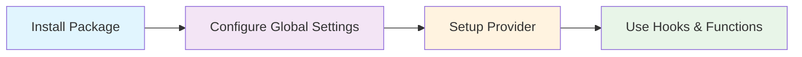
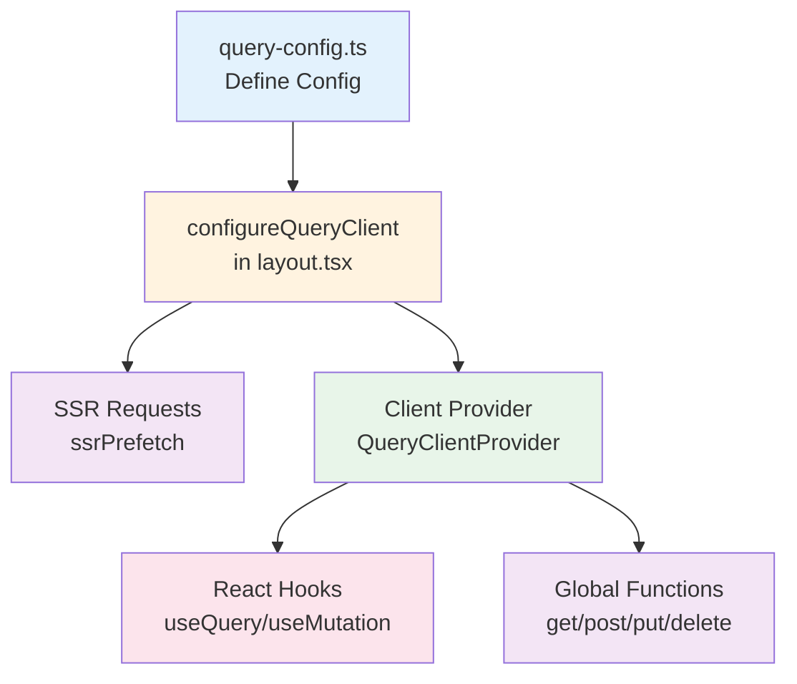
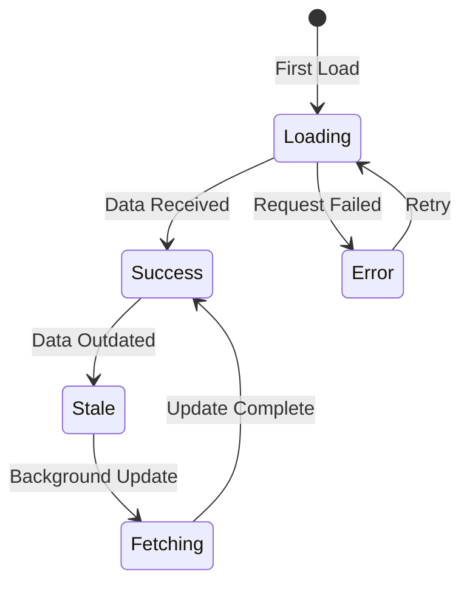
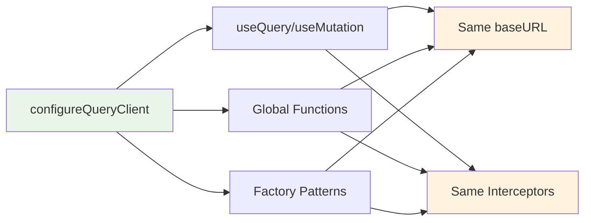
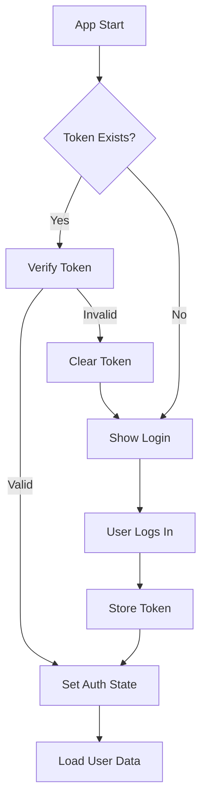

# Next Unified Query User Guide

> 🚀 A complete guide to building modern React applications with Next Unified Query - the high-performance HTTP client and state management library.

## 📚 Table of Contents

- [🚀 Getting Started](#-getting-started)
- [🧠 Core Concepts](#-core-concepts)
- [📖 Step-by-Step Tutorials](#-step-by-step-tutorials)
- [🔄 Common Patterns](#-common-patterns)
- [✨ Best Practices](#-best-practices)
- [🔧 Troubleshooting](#-troubleshooting)
- [❓ FAQ](#-faq)

## 🚀 Getting Started

### What is Next Unified Query?

Next Unified Query is a modern HTTP client and state management library designed specifically for React applications. Built with modern web standards and React best practices, it provides:

- ⚡ **Lightning Fast**: High-performance data fetching (142ms average processing time)
- 🛡️ **Type Safe**: Full TypeScript support with automatic type inference
- 📦 **Small Bundle**: Only 26KB gzipped
- 🔄 **Smart Caching**: 47.3x cache performance improvement with 100% hit rate
- 🌐 **SSR Ready**: Built-in server-side rendering support

### Installation

```bash
npm install next-unified-query
```

That's it! The core package is automatically included.

### 📦 **Import Structure**

Next Unified Query provides two import paths for different environments:

```typescript
// 🌐 Server & Client Safe - Core functionality (no React context)
import { 
  createQueryFactory, 
  createMutationFactory, 
  z, 
  QueryClient,
  ssrPrefetch 
} from 'next-unified-query';

// ⚛️ Client Only - React hooks and components (uses React context)
import { 
  useQuery, 
  useMutation, 
  QueryClientProvider, 
  HydrationBoundary 
} from 'next-unified-query/react';
```

**Why separate imports?**
- **`next-unified-query`**: Server-safe functions that work in both server and client environments
- **`next-unified-query/react`**: Client-only React features that use context (automatic "use client" directive)

### 🎉 **Built-in Dependencies**

Next Unified Query includes these popular libraries, so **no separate installation needed**:
- **Zod**: `import { z } from 'next-unified-query'` - Schema validation and TypeScript inference
- **es-toolkit**: High-performance utility functions (40% smaller than lodash)
- **quick-lru**: Optimized LRU cache implementation

### 🚀 **Important: Type Parameter Order (v0.2.0+)**

The `useMutation` hook now uses an improved, more intuitive type parameter order:

```tsx
// NEW (v0.2.0+): TVariables → TData → TError
// Matches the natural flow: what you send → what you get back
useMutation<CreateUserInput, User>({...})
useMutation<UpdateInput, Result, CustomError>({...})

// This is more intuitive than the old order which was:
// OLD: TData → TError → TVariables (confusing!)
```

**Why this change?**
- **Natural flow**: Variables (input) → Data (output) follows the request flow
- **Consistency**: Matches common TypeScript patterns and other libraries
- **Better inference**: TypeScript can better infer types with this order

### Quick Setup



**🔧 Key Features You'll Get:**
- ✅ **Automatic baseURL application**: baseURL is automatically applied to all requests
- ✅ **Unified configuration management**: React hooks and global functions share the same configuration
- ✅ **Type safety**: Complete TypeScript support and schema validation
- ✅ **SSR support**: Perfect compatibility with Next.js App Router

**Step 1: Create Shared Configuration**

Define your configuration once and use it everywhere - SSR, client, and global functions.

```tsx
// app/query-config.ts - Shared configuration file
import type { QueryClientOptions } from 'next-unified-query';

export const queryConfig: QueryClientOptions = {
  baseURL: process.env.NEXT_PUBLIC_API_URL || 'http://localhost:3002/api',
  timeout: 10000,
  queryCache: {
    maxQueries: 1000,
    gcTime: 5 * 60 * 1000, // 5 minutes
  },
  headers: {
    'Content-Type': 'application/json',
    'X-Client-Version': '1.0.0'
  },
  
  // 🆕 Environment-specific interceptors (v0.2.0+)
  // No more typeof window checks needed!
  
  // Common interceptors (run in all environments)
  interceptors: {
    request: (config) => {
      // Add common headers
      config.headers = config.headers || {};
      config.headers['X-App-Version'] = '1.0.0';
      return config;
    },
    response: (response) => {
      // Log responses in all environments
      console.log(`[${response.config?.method}] ${response.config?.url} - ${response.status}`);
      return response;
    }
  },
  
  // Client-only interceptors (browser environment)
  clientInterceptors: {
    request: (config) => {
      // Direct access to browser APIs - no typeof checks!
      const token = localStorage.getItem('token');
      if (token) {
        config.headers = config.headers || {};
        config.headers['Authorization'] = `Bearer ${token}`;
      }
      return config;
    },
    error: (error) => {
      // Handle client-side errors
      if (error.response?.status === 401) {
        localStorage.removeItem('token');
        window.location.href = '/login';
      }
      return Promise.reject(error);
    }
  },
  
  // Server-only interceptors (Node.js environment)  
  serverInterceptors: {
    request: (config) => {
      // Access server-only resources
      config.headers = config.headers || {};
      config.headers['X-Server-Region'] = process.env.REGION || 'us-east-1';
      config.headers['X-Internal-Key'] = process.env.INTERNAL_API_KEY;
      return config;
    },
    response: (response) => {
      // Server-side logging (could use file system or external service)
      console.log(`[Server] Request completed: ${response.config?.url}`);
      return response;
    }
  }
};
```

**Step 2: Configure in Layout (SSR Support)**

```tsx
// app/layout.tsx (Next.js App Router)
import { configureQueryClient } from 'next-unified-query';
import { queryConfig } from './query-config';
import { Providers } from './providers';

// 🌟 Configure for both SSR and client environments
configureQueryClient(queryConfig);

export default function RootLayout({
  children,
}: {
  children: React.ReactNode;
}) {
  return (
    <html lang="en">
      <body>
        <Providers>{children}</Providers>
      </body>
    </html>
  );
}
```

**Step 3: Create Client Provider**

```tsx
// app/providers.tsx (Client Component)
'use client';

import { QueryClientProvider } from 'next-unified-query/react';
import { queryConfig } from './query-config';

export function Providers({ children }: { children: React.ReactNode }) {
  return (
    <QueryClientProvider config={queryConfig}>
      {children}
    </QueryClientProvider>
  );
}
```

**Step 4: Start Using All Request Methods**

Now all request methods automatically use the same configuration:

```tsx
// app/users/page.tsx
import { useQuery, useMutation } from 'next-unified-query/react';
import { post, get } from 'next-unified-query';

export default function UsersPage() {
  // 🔄 useQuery - baseURL automatically applied
  const { data, isLoading } = useQuery({
    cacheKey: ['users'],
    url: '/users'  // ✅ Requests to http://localhost:3002/api/users
  });

  // 🔄 useMutation - baseURL automatically applied  
  const createUserMutation = useMutation({
    url: '/users',     // ✅ Requests to http://localhost:3002/api/users
    method: 'POST'
  });

  // 🔄 Global functions also use baseURL automatically
  const handleDirectApiCall = async () => {
    const user = await get('/users/1');     // ✅ Automatic baseURL applied
    const newUser = await post('/users', {  // ✅ Automatic baseURL applied
      name: 'New User',
      email: 'user@example.com'
    });
  };

  if (isLoading) return <div>Loading...</div>;

  return (
    <div>
      <ul>
        {data?.map(user => (
          <li key={user.id}>{user.name}</li>
        ))}
      </ul>
      
      <button 
        onClick={() => createUserMutation.mutate({ 
          name: 'John', 
          email: 'john@example.com' 
        })}
      >
        Add User
      </button>
    </div>
  );
}
```

**🎉 Complete! You now have:**

✅ **Consistent API calls**: All requests use the same baseURL and configuration  
✅ **Type safety**: Compile-time error detection  
✅ **Automatic caching**: Prevents duplicate requests and optimizes performance  
✅ **SSR support**: Fast loading by pre-fetching data on server  
✅ **Developer experience**: Powerful features with simple configuration

## 🧠 Core Concepts

### Unified Configuration System

Next Unified Query provides a powerful configuration system that ensures consistency across all environments:

#### `configureQueryClient()`

Sets global configuration that's shared between SSR and client environments:

```typescript
// app/layout.tsx
import { configureQueryClient } from 'next-unified-query';

configureQueryClient({
  baseURL: 'https://api.example.com',
  headers: { 'Authorization': 'Bearer token' },
  interceptors: { /* ... */ }
});
```

**Key Benefits:**
- ✅ **Single source of truth**: One configuration for all environments
- ✅ **SSR compatibility**: Works in both server and client contexts
- ✅ **Automatic propagation**: All request methods use the same config
- ✅ **Type safety**: Full TypeScript support for configuration

#### Configuration Flow



### Data Flow Architecture

```mermaid
graph TB
    subgraph "React Layer"
        A[useQuery<br/>GET/HEAD only] --> B[useMutation<br/>POST/PUT/DELETE/etc]
        C[Factory Patterns<br/>Type-safe APIs]
    end
    
    subgraph "Global Functions Layer"
        D[get(), post(), put()<br/>delete(), patch()]
        E[Unified Configuration<br/>baseURL + interceptors]
    end
    
    subgraph "Query Client Layer"
        F[Query Observer] --> G[Query Cache<br/>LRU + GC]
        H[Mutation Manager] --> G
        I[Configuration Manager<br/>configureQueryClient]
    end
    
    subgraph "Network Layer"
        J[HTTP Client] --> K[Interceptors<br/>Request/Response/Error]
        K --> L[API Server]
    end
    
    A --> F
    B --> H
    C --> F
    C --> H
    D --> J
    E --> K
    I --> E
    I --> J
    F --> J
    H --> J
    
    style A fill:#e3f2fd
    style B fill:#e3f2fd
    style C fill:#e1f5fe
    style D fill:#f3e5f5
    style E fill:#fff3e0
    style F fill:#f3e5f5
    style G fill:#fff3e0
    style H fill:#f3e5f5
    style I fill:#e8f5e8
    style J fill:#e8f5e8
```

### Key Concepts

#### 1. **Cache Keys**
Unique identifiers for your data:

```tsx
// Simple key
cacheKey: ['users']

// Parameterized key
cacheKey: ['user', userId]

// Complex key
cacheKey: ['posts', { userId, status: 'published' }]
```

#### 2. **Query States**
Your data can be in different states:



#### 3. **Automatic Re-rendering**
Components only re-render when the data they actually use changes:

```tsx
// ✅ Only re-renders when 'data' changes
const { data } = useQuery({ ... });

// ❌ Re-renders on any state change
const result = useQuery({ ... });
```

#### 4. **Unified Configuration System**
Once configured, it automatically applies to all request methods:

```tsx
// Global configuration once
configureQueryClient({
  baseURL: 'https://api.example.com',
  headers: { 'Authorization': 'Bearer token' }
});

// ✅ All methods automatically use baseURL
const { data } = useQuery({ url: '/users' });        // 🔄 automatically applied
const mutation = useMutation({ url: '/users' });     // 🔄 automatically applied  
const response = await post('/users', data);         // 🔄 automatically applied
```

#### 5. **HTTP Method Type Safety**
Strict type separation based on request purpose prevents errors:

```tsx
// ✅ Data fetching - only GET/HEAD allowed
const { data } = useQuery({
  cacheKey: ['users'],
  url: '/users'  // GET method (default)
});

// ✅ Data modification - POST/PUT/DELETE/PATCH allowed
const mutation = useMutation({
  url: '/users',
  method: 'POST'  // All methods except GET
});

// ❌ Compilation error - useQuery doesn't support POST
const query = useQuery({
  url: '/users',
  method: 'POST'  // TypeScript error!
});
```

#### 6. **Factory Pattern Integration**
Type-safe API definitions with reusable structure:

```tsx
// Query factory - for data fetching
const userQueries = createQueryFactory({
  list: {
    cacheKey: () => ['users'] as const,
    url: () => '/users'
  },
  get: {
    cacheKey: (id: number) => ['users', id] as const,
    url: (id: number) => `/users/${id}`
  }
});

// Mutation factory - for data modification
const userMutations = createMutationFactory({
  create: {
    url: () => '/users',
    method: 'POST'
  }
});

// Type-safe when using
const { data } = useQuery(userQueries.list);           // ✅ Type inference
const mutation = useMutation(userMutations.create);    // ✅ Type inference
```

#### 7. **Smart Caching & Performance**
Prevent unnecessary requests and re-rendering with intelligent caching:

```tsx
// Same cache key = reuse cached data
function UserProfile({ userId }: { userId: number }) {
  const { data } = useQuery({
    cacheKey: ['user', userId],
    url: `/users/${userId}`
  });
  // Already loaded user is displayed immediately ⚡
}

function UsersList() {
  const { data } = useQuery({
    cacheKey: ['user', 1],  // Same cache key
    url: '/users/1'
  });
  // Data fetched immediately from cache ⚡
}
```

#### 8. **Global Functions Synchronization**
Global functions are fully synchronized with QueryClient configuration:



```tsx
// Configuration once
configureQueryClient({
  baseURL: 'https://api.example.com',
  interceptors: {
    request: authInterceptor
  }
});

// 🔄 All requests use the same configuration
const { data } = useQuery({ url: '/users' });      // interceptors + baseURL
const response = await get('/users');               // interceptors + baseURL  
const mutation = useMutation({ url: '/users' });   // interceptors + baseURL
```

### Error Boundary Support *(v0.2.0+)*

Next Unified Query provides built-in Error Boundary components for graceful error handling:

```tsx
import { QueryErrorBoundary } from 'next-unified-query/react';

function App() {
  return (
    <QueryErrorBoundary
      fallback={(error, reset) => (
        <div>
          <h2>Something went wrong!</h2>
          <p>{error.message}</p>
          <button onClick={reset}>Try again</button>
        </div>
      )}
      onError={(error, errorInfo) => {
        // Log to error tracking service
        console.error('Error caught:', error, errorInfo);
      }}
      resetKeys={['userId']} // Auto-reset when these keys change
    >
      <YourApp />
    </QueryErrorBoundary>
  );
}
```

**Key Features:**
- **Declarative error handling**: No need for try-catch blocks
- **Automatic error propagation**: Use `throwOnError` option in queries/mutations
- **Programmatic reset**: Use `useErrorResetBoundary` hook for manual resets
- **Auto-reset on dependency change**: `resetKeys` prop for automatic recovery

> **⚠️ Important**: When using `throwOnError: true`, make sure your component is wrapped with an Error Boundary. Without an Error Boundary, errors will crash your application. In development mode, you'll see a helpful warning in the console if an Error Boundary is missing.

### React Suspense Integration *(v0.2.0+)*

Enable React Suspense for declarative loading states:

```tsx
import { Suspense } from 'react';

function UserList() {
  // Enable suspense mode - no loading state needed!
  const { data } = useQuery({
    url: '/users',
    suspense: true  // ✅ Enable Suspense
  });
  
  // Direct data usage - Suspense handles loading
  return (
    <ul>
      {data.map(user => (
        <li key={user.id}>{user.name}</li>
      ))}
    </ul>
  );
}

// Wrap with Suspense boundary
function App() {
  return (
    <Suspense fallback={<LoadingSpinner />}>
      <UserList />
    </Suspense>
  );
}
```

**Benefits:**
- **Simplified components**: No `isLoading` checks needed
- **Better UX**: Coordinated loading states across components
- **Concurrent features**: Ready for React 18+ concurrent rendering
- **Combine with Error Boundary**: Complete async state handling

> **⚠️ Important**: When using `suspense: true`, make sure your component is wrapped with `<Suspense>`. Without a Suspense boundary, your app may crash when the component suspends. In development mode, you'll see a helpful warning in the console if a Suspense boundary is missing.

### Global Default Options *(v0.2.0+)*

Configure default behavior for all queries and mutations:

```tsx
<QueryClientProvider config={{
  baseURL: 'https://api.example.com',
  defaultOptions: {
    queries: {
      staleTime: 5 * 60 * 1000,      // Data stays fresh for 5 minutes
      gcTime: 10 * 60 * 1000,         // Keep in cache for 10 minutes
      throwOnError: false,            // Don't throw by default
      suspense: false                 // Suspense disabled by default
    },
    mutations: {
      throwOnError: (error) => {
        // Only throw on server errors
        return error.response?.status >= 500;
      }
    }
  }
}}>
  {children}
</QueryClientProvider>
```

**Override when needed:**
```tsx
// Override global defaults for specific queries
const { data } = useQuery({
  url: '/critical-data',
  staleTime: 0,           // Always fresh (override: 5min → 0)
  suspense: true,          // Enable Suspense (override: false → true)
  throwOnError: true       // Throw to Error Boundary (override: false → true)
});
```

**Benefits:**
- **Consistency**: All queries share sensible defaults
- **Less boilerplate**: No need to repeat common options
- **Flexible overrides**: Change behavior for specific cases
- **Type-safe**: Full TypeScript support for all options

## 📖 Step-by-Step Tutorials

### Tutorial 1: Building a Todo App

Let's build a complete Todo application step by step.

#### Step 1: Set Up the Project Structure

```
src/
├── app/
│   ├── layout.tsx
│   ├── page.tsx
│   └── providers.tsx
├── components/
│   ├── TodoList.tsx
│   ├── TodoItem.tsx
│   └── AddTodo.tsx
└── lib/
    └── queries.ts
```

#### Step 2: Define Your Queries

```tsx
// lib/queries.ts
import { createQueryFactory, createMutationFactory, z } from 'next-unified-query';

// ✨ Zod is built-in! No separate installation needed

// Define schemas for type safety
const todoSchema = z.object({
  id: z.number(),
  title: z.string(),
  completed: z.boolean(),
  createdAt: z.string()
});

const createTodoSchema = todoSchema.omit({ id: true, createdAt: true });

// Create query factory
export const todoQueries = createQueryFactory({
  list: {
    cacheKey: () => ['todos'] as const,
    url: () => '/api/todos',
    schema: z.array(todoSchema)
  },
  
  get: {
    cacheKey: (id: number) => ['todos', id] as const,
    url: (id: number) => `/api/todos/${id}`,
    schema: todoSchema
  }
});

// Create mutation factory - improved type parameter order in v0.2.0+
// Now: TVariables (input) → TData (output) → TError (optional)
export const todoMutations = createMutationFactory({
  create: {
    url: () => '/api/todos',
    method: 'POST',
    requestSchema: createTodoSchema,  // TVariables type
    responseSchema: todoSchema        // TData type
  },
  
  update: {
    url: ({ id }: { id: number }) => `/api/todos/${id}`,
    method: 'PUT',
    requestSchema: todoSchema,
    responseSchema: todoSchema
  },
  
  delete: {
    url: (id: number) => `/api/todos/${id}`,
    method: 'DELETE'
  }
});
```

#### Step 3: Build the Todo List Component

```tsx
// components/TodoList.tsx
import { useQuery } from 'next-unified-query/react';
import { todoQueries } from '@/lib/queries';
import { TodoItem } from './TodoItem';

export function TodoList() {
  const { data: todos, isLoading, error } = useQuery(todoQueries.list);

  if (isLoading) {
    return (
      <div className="animate-pulse">
        {[...Array(3)].map((_, i) => (
          <div key={i} className="h-12 bg-gray-200 rounded mb-2" />
        ))}
      </div>
    );
  }

  if (error) {
    return (
      <div className="text-red-500 p-4 border border-red-200 rounded">
        Error loading todos: {error.message}
      </div>
    );
  }

  return (
    <div className="space-y-2">
      {todos?.length === 0 ? (
        <p className="text-gray-500 text-center py-8">
          No todos yet. Add one above!
        </p>
      ) : (
        todos?.map(todo => (
          <TodoItem key={todo.id} todo={todo} />
        ))
      )}
    </div>
  );
}
```

#### Step 4: Create Todo Item with Optimistic Updates

```tsx
// components/TodoItem.tsx
import { useMutation, useQueryClient } from 'next-unified-query/react';
import { todoMutations } from '@/lib/queries';

interface TodoItemProps {
  todo: {
    id: number;
    title: string;
    completed: boolean;
  };
}

export function TodoItem({ todo }: TodoItemProps) {
  const queryClient = useQueryClient();

  // Using new type parameter order: TVariables, TData
  const updateMutation = useMutation({
    ...todoMutations.update,
    onMutate: async (newTodo) => {
      // Cancel any outgoing refetches
      await queryClient.cancelQueries(['todos']);

      // Snapshot the previous value
      const previousTodos = queryClient.get(['todos']);

      // Optimistically update to the new value
      queryClient.setQueryData(['todos'], (old) =>
        old?.map(t => t.id === todo.id ? { ...t, ...newTodo } : t)
      );

      return { previousTodos };
    },
    onError: (err, newTodo, context) => {
      // Rollback on error
      if (context?.previousTodos) {
        queryClient.setQueryData(['todos'], context.previousTodos);
      }
    },
    onSettled: () => {
      // Always refetch after error or success
      queryClient.invalidateQueries([['todos']]);
    }
  });

  const deleteMutation = useMutation({
    ...todoMutations.delete,
    onSuccess: () => {
      // Remove from cache
      queryClient.setQueryData(['todos'], (old) =>
        old?.filter(t => t.id !== todo.id)
      );
    }
  });

  const toggleComplete = () => {
    updateMutation.mutate({
      id: todo.id,
      title: todo.title,
      completed: !todo.completed
    });
  };

  return (
    <div className="flex items-center gap-3 p-3 border rounded hover:bg-gray-50">
      <input
        type="checkbox"
        checked={todo.completed}
        onChange={toggleComplete}
        disabled={updateMutation.isPending}
        className="w-4 h-4"
      />
      
      <span className={`flex-1 ${todo.completed ? 'line-through text-gray-500' : ''}`}>
        {todo.title}
      </span>
      
      <button
        onClick={() => deleteMutation.mutate(todo.id)}
        disabled={deleteMutation.isPending}
        className="text-red-500 hover:text-red-700 px-2 py-1"
      >
        {deleteMutation.isPending ? 'Deleting...' : 'Delete'}
      </button>
    </div>
  );
}
```

#### Step 5: Add Todo Form

```tsx
// components/AddTodo.tsx
import { useState } from 'react';
import { useMutation, useQueryClient } from 'next-unified-query/react';
import { todoMutations } from '@/lib/queries';

export function AddTodo() {
  const [title, setTitle] = useState('');
  const queryClient = useQueryClient();

  const createMutation = useMutation({
    ...todoMutations.create,
    onSuccess: (newTodo) => {
      // Add to cache
      queryClient.setQueryData(['todos'], (old = []) => [...old, newTodo]);
      setTitle(''); // Reset form
    }
  });

  const handleSubmit = (e: React.FormEvent) => {
    e.preventDefault();
    if (title.trim()) {
      createMutation.mutate({
        title: title.trim(),
        completed: false
      });
    }
  };

  return (
    <form onSubmit={handleSubmit} className="mb-6">
      <div className="flex gap-2">
        <input
          type="text"
          value={title}
          onChange={(e) => setTitle(e.target.value)}
          placeholder="Add a new todo..."
          className="flex-1 px-3 py-2 border rounded focus:outline-none focus:ring-2 focus:ring-blue-500"
          disabled={createMutation.isPending}
        />
        <button
          type="submit"
          disabled={createMutation.isPending || !title.trim()}
          className="px-4 py-2 bg-blue-500 text-white rounded hover:bg-blue-600 disabled:opacity-50"
        >
          {createMutation.isPending ? 'Adding...' : 'Add'}
        </button>
      </div>
      
      {createMutation.error && (
        <p className="text-red-500 text-sm mt-2">
          Error: {createMutation.error.message}
        </p>
      )}
    </form>
  );
}
```

#### Step 6: Put It All Together

```tsx
// app/page.tsx
import { AddTodo } from '@/components/AddTodo';
import { TodoList } from '@/components/TodoList';

export default function HomePage() {
  return (
    <div className="max-w-md mx-auto mt-8 p-6">
      <h1 className="text-2xl font-bold mb-6">My Todo App</h1>
      <AddTodo />
      <TodoList />
    </div>
  );
}
```

### Tutorial 2: User Authentication Flow

#### Authentication State Management



```tsx
// lib/auth.ts
import { createQueryFactory, createMutationFactory } from 'next-unified-query';

export const authQueries = createQueryFactory({
  me: {
    cacheKey: () => ['auth', 'me'] as const,
    url: () => '/api/auth/me',
    enabled: () => !!localStorage.getItem('token')
  }
});

export const authMutations = createMutationFactory({
  login: {
    url: () => '/api/auth/login',
    method: 'POST'
  },
  
  logout: {
    mutationFn: async () => {
      localStorage.removeItem('token');
      return { success: true };
    }
  }
});

// components/AuthProvider.tsx
export function AuthProvider({ children }: { children: React.ReactNode }) {
  const queryClient = useQueryClient();
  const { data: user, isLoading } = useQuery(authQueries.me);

  const logoutMutation = useMutation({
    ...authMutations.logout,
    onSuccess: () => {
      queryClient.clear(); // Clear all cache on logout
      queryClient.invalidateQueries([['auth']]);
    }
  });

  if (isLoading) {
    return <div>Loading...</div>;
  }

  return (
    <AuthContext.Provider value={{ user, logout: logoutMutation.mutate }}>
      {children}
    </AuthContext.Provider>
  );
}
```

## 🔄 Common Patterns

### Pattern 1: Error Boundary + Suspense Pattern *(v0.2.0+)*

Combine Error Boundary and Suspense for complete async state handling:

```tsx
import { QueryErrorBoundary } from 'next-unified-query/react';
import { Suspense } from 'react';

function App() {
  return (
    <QueryErrorBoundary
      fallback={(error, reset) => <ErrorDisplay error={error} onReset={reset} />}
      onError={(error) => console.error('Query error:', error)}
    >
      <Suspense fallback={<LoadingSpinner />}>
        <Dashboard />
      </Suspense>
    </QueryErrorBoundary>
  );
}

function Dashboard() {
  // All queries use suspense and throwOnError
  const { data: user } = useQuery({
    url: '/api/user',
    suspense: true,
    throwOnError: true
  });
  
  const { data: stats } = useQuery({
    url: '/api/stats',
    suspense: true,
    throwOnError: true
  });
  
  // Clean components - no loading/error checks needed!
  return (
    <div>
      <h1>Welcome, {user.name}!</h1>
      <StatsDisplay stats={stats} />
    </div>
  );
}
```

### Pattern 2: Global Defaults with Selective Overrides *(v0.2.0+)*

Set sensible defaults globally, override for specific cases:

```tsx
// Global configuration
<QueryClientProvider config={{
  defaultOptions: {
    queries: {
      staleTime: 5 * 60 * 1000,  // 5 minutes default
      suspense: true,             // Suspense by default
      throwOnError: true          // Error Boundary by default
    }
  }
}}>

// Most queries use defaults
function UserProfile() {
  const { data } = useQuery({ url: '/api/user' });
  // Uses: staleTime: 5min, suspense: true, throwOnError: true
}

// Override for real-time data
function LiveStats() {
  const { data } = useQuery({
    url: '/api/live-stats',
    staleTime: 0,          // Always fresh (override)
    refetchInterval: 1000  // Poll every second
  });
}

// Override for non-critical data
function Recommendations() {
  const { data } = useQuery({
    url: '/api/recommendations',
    throwOnError: false,   // Don't crash on error (override)
    suspense: false        // Show inline loading (override)
  });
  
  if (!data) return <div>Loading recommendations...</div>;
  return <RecommendationList items={data} />;
}
```

### Pattern 3: Dependent Queries

Sometimes you need to fetch data based on other data:

```tsx
function UserPosts({ userId }: { userId: number }) {
  // First query: Get user
  const { data: user } = useQuery({
    cacheKey: ['user', userId],
    url: `/api/users/${userId}`
  });

  // Second query: Get user's posts (depends on user data)
  const { data: posts } = useQuery({
    cacheKey: ['posts', 'user', userId],
    url: `/api/posts?userId=${userId}`,
    enabled: !!user // Only run when user data is available
  });

  return (
    <div>
      <h2>{user?.name}'s Posts</h2>
      {posts?.map(post => (
        <div key={post.id}>{post.title}</div>
      ))}
    </div>
  );
}
```

### Pattern 2: Infinite Scrolling

```tsx
function InfinitePostList() {
  const [pages, setPages] = useState([0]);
  
  const queries = pages.map(page => 
    useQuery({
      cacheKey: ['posts', 'page', page],
      url: `/api/posts?page=${page}&limit=10`
    })
  );

  const allPosts = queries.flatMap(q => q.data?.posts || []);
  const hasMore = queries[queries.length - 1]?.data?.hasMore;
  const isLoadingMore = queries[queries.length - 1]?.isFetching;

  const loadMore = () => {
    if (hasMore && !isLoadingMore) {
      setPages(prev => [...prev, prev.length]);
    }
  };

  return (
    <div>
      {allPosts.map(post => (
        <PostCard key={post.id} post={post} />
      ))}
      
      {hasMore && (
        <button onClick={loadMore} disabled={isLoadingMore}>
          {isLoadingMore ? 'Loading...' : 'Load More'}
        </button>
      )}
    </div>
  );
}
```

### Pattern 3: Real-time Updates

```tsx
function useRealtimeQuery(queryKey: string[], url: string) {
  const queryClient = useQueryClient();
  const query = useQuery({ cacheKey: queryKey, url });

  useEffect(() => {
    const eventSource = new EventSource(`${url}/stream`);
    
    eventSource.onmessage = (event) => {
      const newData = JSON.parse(event.data);
      queryClient.setQueryData(queryKey, newData);
    };

    return () => eventSource.close();
  }, [queryKey, url, queryClient]);

  return query;
}

// Usage
function LiveDashboard() {
  const { data } = useRealtimeQuery(['dashboard'], '/api/dashboard');
  
  return <div>Live data: {JSON.stringify(data)}</div>;
}
```

## ✨ Best Practices

### 1. Query Key Naming

```tsx
// ✅ Good: Hierarchical and descriptive
['users']                    // All users
['users', userId]           // Specific user
['users', userId, 'posts']  // User's posts
['posts', { status: 'published', limit: 10 }] // Filtered posts

// ❌ Bad: Flat and unclear
['userList']
['userData123']
['publishedPosts10']
```

### 2. Error Handling

#### Traditional Approach:
```tsx
// Manual error handling in every component
function UserProfile({ userId }: { userId: number }) {
  const { data, isLoading, error, refetch } = useQuery({
    cacheKey: ['user', userId],
    url: `/api/users/${userId}`
  });

  if (isLoading) return <Spinner />;
  
  if (error) {
    return (
      <div className="error-container">
        <h3>Something went wrong</h3>
        <p>{error.message}</p>
        <button onClick={() => refetch()}>Try Again</button>
      </div>
    );
  }

  return <div>{data?.name}</div>;
}
```

#### ✅ Modern Approach with Error Boundary *(v0.2.0+)*:
```tsx
// Centralized error handling with Error Boundary
import { QueryErrorBoundary } from 'next-unified-query/react';

// Wrap once at the top level
function App() {
  return (
    <QueryErrorBoundary
      fallback={(error, reset) => (
        <div className="error-container">
          <h3>Something went wrong</h3>
          <p>{error.message}</p>
          <button onClick={reset}>Try Again</button>
        </div>
      )}
    >
      <UserProfile userId={1} />
    </QueryErrorBoundary>
  );
}

// Clean component - no error handling boilerplate!
function UserProfile({ userId }: { userId: number }) {
  const { data } = useQuery({
    cacheKey: ['user', userId],
    url: `/api/users/${userId}`,
    throwOnError: true  // Let Error Boundary handle it
  });

  return <div>{data?.name}</div>;
}
```

### 3. Loading States

```tsx
// ✅ Good: Contextual loading states
function ProductList() {
  const { data, isLoading, isFetching } = useQuery({
    cacheKey: ['products'],
    url: '/api/products'
  });

  return (
    <div>
      <div className="header">
        <h2>Products</h2>
        {isFetching && <Spinner size="small" />}
      </div>
      
      {isLoading ? (
        <ProductListSkeleton />
      ) : (
        <div>
          {data?.map(product => (
            <ProductCard key={product.id} product={product} />
          ))}
        </div>
      )}
    </div>
  );
}
```

### 4. Cache Management

```tsx
// ✅ Good: Strategic cache invalidation
// Type parameters: TVariables (input), TData (output)
const updateUserMutation = useMutation<UpdateUserInput, User>({
  url: '/users',
  method: 'PUT',
  onSuccess: (updatedUser) => {
    // Update specific user
    queryClient.setQueryData(['user', updatedUser.id], updatedUser);
    
    // Invalidate related queries
    queryClient.invalidateQueries([['users']]); // User list
    queryClient.invalidateQueries([['posts', 'user', updatedUser.id]]); // User's posts
  }
});
```

### 5. baseURL Configuration Best Practices

Improve consistency and maintainability with centralized configuration:

```tsx
// ✅ Good: Environment-specific configuration separation
// config/api.ts
const API_CONFIG = {
  development: {
    baseURL: 'http://localhost:3002/api',
    timeout: 10000,
  },
  production: {
    baseURL: 'https://api.example.com',
    timeout: 15000,
  }
};

export const getApiConfig = () => {
  const env = process.env.NODE_ENV as keyof typeof API_CONFIG;
  return API_CONFIG[env] || API_CONFIG.development;
};

// app/providers.tsx
<QueryClientProvider config={{
  ...getApiConfig(),
  headers: {
    'Content-Type': 'application/json',
    'X-Client-Version': process.env.npm_package_version || '1.0.0'
  }
}}>

// ❌ Bad: Hard-coded URLs
const { data } = useQuery({
  url: 'http://localhost:3002/api/users'  // Difficult to change per environment
});
```

### 6. HTTP Method Selection Guide

Clarify your intent with proper method selection:

```tsx
// ✅ Good: Clear purpose separation
// Data fetching - use useQuery
const { data: users } = useQuery({
  cacheKey: ['users'],
  url: '/users'  // GET request (automatic)
});

// Data creation - use useMutation
// Type order: TVariables (what you send) → TData (what you get back)
const createUser = useMutation<CreateUserInput, User>({
  url: '/users',
  method: 'POST'  // Explicit POST
});

// Direct API calls - use global functions
const handleExport = async () => {
  const csvData = await get('/users/export');     // GET - fetch data
  await post('/analytics', { action: 'export' }); // POST - record event
};

// ❌ Bad: Purpose mismatch
const result = useMutation({
  url: '/users',
  method: 'GET'  // Using GET with useMutation is anti-pattern
});
```

### 7. Factory Pattern Utilization

Factory pattern for enhanced type safety and reusability:

```tsx
// ✅ Good: Systematic Factory structure
// api/users.ts
export const userQueries = createQueryFactory({
  // List queries
  list: {
    cacheKey: (filters?: UserFilters) => ['users', filters] as const,
    url: (filters?: UserFilters) => {
      const params = new URLSearchParams(filters);
      return `/users?${params}`;
    },
    schema: z.array(userSchema)
  },
  
  // Single user query
  get: {
    cacheKey: (id: number) => ['users', id] as const,
    url: (id: number) => `/users/${id}`,
    schema: userSchema
  },
  
  // Complex query (Custom Function)
  dashboard: {
    cacheKey: (userId: number) => ['users', userId, 'dashboard'] as const,
    queryFn: async (userId: number, fetcher) => {
      const [user, stats, activities] = await Promise.all([
        fetcher.get(`/users/${userId}`),
        fetcher.get(`/users/${userId}/stats`),
        fetcher.get(`/users/${userId}/activities`)
      ]);
      return { user: user.data, stats: stats.data, activities: activities.data };
    }
  }
});

export const userMutations = createMutationFactory({
  create: {
    url: () => '/users',
    method: 'POST',
    requestSchema: createUserSchema,
    responseSchema: userSchema
  },
  
  update: {
    url: ({ id }: { id: number }) => `/users/${id}`,
    method: 'PUT',
    requestSchema: updateUserSchema,
    responseSchema: userSchema
  },
  
  // Complex operation (Custom Function)
  bulkUpdate: {
    mutationFn: async (updates: BulkUserUpdate[], fetcher) => {
      const results = await Promise.all(
        updates.map(update => 
          fetcher.put(`/users/${update.id}`, update.data)
        )
      );
      return results.map(r => r.data);
    }
  }
});

// When using
const { data: users } = useQuery(userQueries.list, { 
  params: { status: 'active' } 
});
const createMutation = useMutation(userMutations.create);

// ❌ Bad: Low reusability with inline definitions
const { data } = useQuery({
  cacheKey: ['users'],  // Defined anew each time
  url: '/users'
});
```

### 8. Global Functions vs Hooks Selection Criteria

Choose the appropriate request method for each situation:

```tsx
// ✅ Good: Appropriate tool selection

// 1. Data display in components → useQuery
function UserProfile({ userId }: { userId: number }) {
  const { data, isLoading, error } = useQuery({
    cacheKey: ['user', userId],
    url: `/users/${userId}`
  });
  
  if (isLoading) return <Loading />;
  if (error) return <Error error={error} />;
  return <UserCard user={data} />;
}

// 2. Data modification by user actions → useMutation
function CreateUserForm() {
  // Type parameters match the natural flow: input → output
  const createUser = useMutation<CreateUserInput, User>({
    url: '/users',
    method: 'POST',
    onSuccess: (newUser) => {
      toast.success(`User ${newUser.name} created!`);
      navigate('/users');
    }
  });
  
  return (
    <form onSubmit={(data) => createUser.mutate(data)}>
      {/* form fields */}
    </form>
  );
}

// 3. Event handlers or utility functions → Global Functions
async function exportUsers() {
  try {
    const response = await get('/users/export');
    downloadFile(response.data);
    
    // Send analytics event
    await post('/analytics', { 
      action: 'export_users',
      timestamp: Date.now() 
    });
  } catch (error) {
    console.error('Export failed:', error);
  }
}

// 4. Server-side data fetching → Global Functions
// app/users/[id]/page.tsx
export async function generateStaticProps({ params }) {
  const user = await get(`/users/${params.id}`);
  const posts = await get(`/users/${params.id}/posts`);
  
  return {
    props: { user: user.data, posts: posts.data }
  };
}
```

### 9. Interceptor Utilization Patterns

Centralize common logic with environment-specific interceptors (v0.2.0+):

```tsx
// ✅ Best: Environment-specific interceptor structure (no typeof window checks!)
<QueryClientProvider config={{
  baseURL: process.env.NEXT_PUBLIC_API_URL,
  
  // Common interceptors (all environments)
  interceptors: {
    request: (config) => {
      // Add common headers
      config.headers['X-App-Version'] = '1.0.0';
      config.headers['X-Request-ID'] = generateRequestId();
      return config;
    },
    response: (response) => {
      // Transform API response to standard format
      if (response.data?.data) {
        response.data = response.data.data;
      }
      return response;
    }
  },
  
  // Client-only interceptors (browser)
  clientInterceptors: {
    request: async (config) => {
      // Direct browser API access - no checks needed!
      const token = localStorage.getItem('authToken');
      if (token) {
        config.headers.Authorization = `Bearer ${token}`;
      }
      
      // Add browser-specific headers
      config.headers['X-Client-Version'] = navigator.userAgent;
      return config;
    },
    error: async (error) => {
      if (error.response?.status === 401) {
        // Direct window access
        const refreshed = await refreshAuthToken();
        if (refreshed) {
          return error.config.retry();
        } else {
          localStorage.removeItem('authToken');
          window.location.href = '/login';
        }
      }
      throw error;
    }
  },
  
  // Server-only interceptors (Node.js)
  serverInterceptors: {
    request: (config) => {
      // Server-specific headers
      config.headers['X-Server-Region'] = process.env.AWS_REGION;
      config.headers['X-Internal-Key'] = process.env.INTERNAL_API_KEY;
      
      // Server-side tracing
      config.headers['X-Trace-ID'] = getTraceId();
      return config;
    },
    response: (response) => {
      // Server-side logging
      logToElasticsearch({
        url: response.config.url,
        status: response.status,
        duration: response.headers['x-response-time']
      });
      return response;
    }
  }
}}>

// Now automatically applied to all requests with appropriate interceptors
const { data } = useQuery({ url: '/protected-data' });    // 🔐 automatic auth
const response = await post('/protected-action', data);   // 🔐 automatic auth
```

### 10. Performance Optimization Tips

Efficient data loading and caching:

```tsx
// ✅ Good: Performance-optimized patterns

// 1. Selective data subscription
const { data: userName } = useQuery({
  cacheKey: ['user', userId],
  url: `/users/${userId}`,
  select: (user) => user.name  // Re-render only when name changes
});

// 2. Conditional queries to prevent unnecessary requests
const { data: posts } = useQuery({
  cacheKey: ['posts', userId],
  url: `/users/${userId}/posts`,
  enabled: !!userId && userRole === 'admin'  // Execute only when condition is met
});

// 3. Appropriate cache time configuration
const { data: staticData } = useQuery({
  cacheKey: ['config'],
  url: '/config',
  staleTime: 5 * 60 * 1000,  // Keep fresh for 5 minutes
  gcTime: 10 * 60 * 1000     // Remove from memory after 10 minutes
});

// 4. Background update optimization
const { data: dashboard } = useQuery({
  cacheKey: ['dashboard'],
  url: '/dashboard',
  refetchInterval: 30000,           // Background refresh every 30 seconds
  refetchIntervalInBackground: false // Stop when tab is inactive
});

// ❌ Bad: Inefficient patterns
const { data } = useQuery({
  cacheKey: ['user-' + Math.random()], // New cache key every time
  url: `/users/${userId}`,
  staleTime: 0  // Request fresh data every time
});
```

## 🔧 Troubleshooting

### Common Issues and Solutions

#### Issue 1: "QueryClient not found" Error

**Problem**: You're trying to use hooks outside of QueryClientProvider.

```tsx
// ❌ Wrong: Hook used outside provider
function App() {
  const { data } = useQuery({ ... }); // Error!
  
  return (
    <QueryClientProvider client={queryClient}>
      <MyComponent />
    </QueryClientProvider>
  );
}
```

**Solution**: Ensure all components using hooks are wrapped by the provider.

```tsx
// ✅ Correct: Hook used inside provider
function App() {
  return (
    <QueryClientProvider client={queryClient}>
      <MyComponent />
    </QueryClientProvider>
  );
}

function MyComponent() {
  const { data } = useQuery({ ... }); // Works!
  return <div>{data}</div>;
}
```

#### Issue 2: Infinite Re-renders

**Problem**: Cache key changes on every render.

```tsx
// ❌ Wrong: Object created on every render
function UserList() {
  const { data } = useQuery({
    cacheKey: ['users', { status: 'active' }], // New object every time!
    url: '/api/users'
  });
}
```

**Solution**: Use stable references.

```tsx
// ✅ Correct: Stable cache key
const ACTIVE_USERS_KEY = ['users', { status: 'active' }] as const;

function UserList() {
  const { data } = useQuery({
    cacheKey: ACTIVE_USERS_KEY,
    url: '/api/users'
  });
}
```

#### Issue 3: Data Not Updating

**Problem**: Stale time is too high or cache not invalidated.

```tsx
// ❌ Wrong: Very long stale time
const { data } = useQuery({
  cacheKey: ['users'],
  url: '/api/users',
  staleTime: 24 * 60 * 60 * 1000 // 24 hours - too long!
});
```

**Solution**: Adjust stale time or invalidate cache appropriately.

```tsx
// ✅ Correct: Reasonable stale time
const { data } = useQuery({
  cacheKey: ['users'],
  url: '/api/users',
  staleTime: 5 * 60 * 1000 // 5 minutes
});

// Invalidate when needed
const updateMutation = useMutation({
  mutationFn: updateUser,
  onSuccess: () => {
    queryClient.invalidateQueries([['users']]);
  }
});
```

## ❓ FAQ

### Q: How is this different from TanStack Query?

**A:** Next Unified Query provides:
- Built-in HTTP client (no need for separate fetch setup)
- Advanced optimizations (selective re-rendering)
- Type-safe query factories
- Better Next.js integration
- Smaller bundle size

### Q: Can I use this with other frameworks besides React?

**A:** The core package (`next-unified-query`) is framework-agnostic and can be used with any JavaScript framework. The React hooks are in a separate export (`next-unified-query/react`).

### Q: How do I handle authentication?

**A:** Use environment-specific interceptors to handle auth tokens cleanly (v0.2.0+):

```tsx
// No more typeof window checks needed!
export const queryConfig: QueryClientOptions = {
  clientInterceptors: {
    request: (config) => {
      // Direct access to browser APIs
      const token = localStorage.getItem('token');
      if (token) {
        config.headers.Authorization = `Bearer ${token}`;
      }
      return config;
    },
    error: (error) => {
      if (error.response?.status === 401) {
        // Direct window access
        localStorage.removeItem('token');
        window.location.href = '/login';
      }
      return Promise.reject(error);
    }
  },
  
  serverInterceptors: {
    request: (config) => {
      // Server-only auth (e.g., internal API keys)
      config.headers['X-Internal-Key'] = process.env.INTERNAL_API_KEY;
      return config;
    }
  }
};
```

### Q: What are environment-specific interceptors?

**A:** Starting from v0.2.0, Next Unified Query provides three types of interceptors:

- **`interceptors`**: Run in all environments (server & client)
- **`clientInterceptors`**: Only run in browser environment
- **`serverInterceptors`**: Only run in Node.js environment

This eliminates the need for `typeof window` checks and makes your code cleaner:

```tsx
// Before (v0.1.x)
interceptors: {
  request: (config) => {
    if (typeof window !== 'undefined') {
      const token = localStorage.getItem('token');
      // ...
    }
    return config;
  }
}

// After (v0.2.0+) - Much cleaner!
clientInterceptors: {
  request: (config) => {
    const token = localStorage.getItem('token'); // Direct access!
    // ...
    return config;
  }
}
```

### Q: How do I debug cache issues?

**A:** Use the built-in cache inspector:

```tsx
function CacheDebugger() {
  const queryClient = useQueryClient();
  
  const stats = queryClient.getCache().getStats();
  const allData = queryClient.getCache().getAll();
  
  return (
    <div>
      <h3>Cache Stats</h3>
      <pre>{JSON.stringify(stats, null, 2)}</pre>
      
      <h3>All Cached Data</h3>
      <pre>{JSON.stringify(allData, null, 2)}</pre>
    </div>
  );
}
```

### Q: How do I handle file uploads?

**A:** Use FormData with mutations:

```tsx
// Type parameters: File (input) → UploadResponse (output)
const uploadMutation = useMutation<File, UploadResponse>({
  mutationFn: async (file, fetcher) => {
    const formData = new FormData();
    formData.append('file', file);
    
    const response = await fetch('/api/upload', {
      method: 'POST',
      body: formData
    });
    
    return response.json();
  }
});
```


### Q: How do I implement SSR with Next.js?

**A:** Use `ssrPrefetch` and `HydrationBoundary`:

```tsx
// app/users/[id]/page.tsx
import { ssrPrefetch } from 'next-unified-query';
import { HydrationBoundary } from 'next-unified-query/react';
import { userQueries } from '@/lib/queries';

export default async function UserPage({ params }) {
  // Server-side data prefetching
  // Note: ssrPrefetch automatically uses the config from configureQueryClient()
  // which was set in app/layout.tsx
  const dehydratedState = await ssrPrefetch([
    [userQueries.get, params.id],
    [userQueries.posts, params.id]
  ]);
  
  // You can also override the global config if needed:
  // const dehydratedState = await ssrPrefetch(
  //   [...queries],
  //   { baseURL: 'https://api.example.com' }
  // );

  return (
    <HydrationBoundary state={dehydratedState}>
      <UserDetail userId={params.id} />
    </HydrationBoundary>
  );
}

function UserDetail({ userId }) {
  // This will use prefetched data immediately
  const { data } = useQuery(userQueries.get, { params: userId });
  
  return <div>{data?.name}</div>;
}
```

### Q: How do I use advanced configuration options?

**A:** Use the provided constants and enums:

```tsx
import { ContentType, ResponseType } from 'next-unified-query';

// File upload with specific content type
// Type parameters: FormData (input) → UploadResult (output)
const uploadMutation = useMutation<FormData, UploadResult>({
  url: '/api/upload',
  method: 'POST',
  fetchConfig: {
    headers: {
      'Content-Type': ContentType.MULTIPART
    }
  }
});

// Download file as blob
const { data } = useQuery({
  cacheKey: ['file', fileId],
  url: `/api/files/${fileId}`,
  fetchConfig: {
    responseType: ResponseType.BLOB
  }
});
```

### Q: How do I handle errors effectively?

**A:** Use the comprehensive error utilities:

```tsx
import { 
  isFetchError, 
  handleHttpError, 
  getValidationErrors 
} from 'next-unified-query';

function UserProfile({ userId }) {
  const { data, error } = useQuery({
    cacheKey: ['user', userId],
    url: `/api/users/${userId}`
  });

  if (error) {
    if (isFetchError(error)) {
      const message = handleHttpError(error, {
        404: () => 'User not found',
        403: () => 'Access denied',
        500: () => 'Server error',
        default: (err) => `Error: ${err.message}`
      });
      return <div className="error">{message}</div>;
    }
  }

  return <div>{data?.name}</div>;
}
```

### Q: What utility functions are available?

**A:** The library provides comprehensive utilities for all common scenarios:

#### 🎯 **User-Facing APIs** (Recommended)


```tsx
import { 
  // Error handling
  isFetchError, handleFetchError, handleHttpError, ErrorCode,
  getValidationErrors, hasErrorCode, isValidationError,
  
  // Response utilities  
  unwrap, getStatus, hasStatus, getHeaders, createError,
  
  // Constants
  ContentType, ResponseType,
  
  // URL utilities
  appendQueryParams, combineURLs,
  
  // Configuration utilities
  mergeConfigs,
  
  // SSR utilities
  ssrPrefetch,
  
  // Built-in Zod
  z, ZodType, ZodSchema
} from 'next-unified-query';

// Example usage
const status = getStatus(response);
const userData = unwrap(response);
const headers = getHeaders(response);

// Advanced error handling
const validationErrors = getValidationErrors(error);
const isNetworkError = hasErrorCode(error, ErrorCode.NETWORK);

// HTTP status-based error handling
const errorMessage = handleHttpError(error, {
  400: () => 'Bad request',
  401: () => 'Unauthorized',
  404: () => 'Not found',
  default: () => 'Server error'
});

// URL utilities
const urlWithParams = appendQueryParams('/api/users', { page: 1, limit: 10 });
const fullUrl = combineURLs('https://api.example.com', '/users');

// Content type constants
const uploadConfig = {
  headers: {
    'Content-Type': ContentType.MULTIPART
  }
};
```

#### ⚠️ **Advanced/Internal APIs** (Advanced Users Only)

```tsx
import { 
  // Advanced classes - React hooks recommended
  QueryObserver, QueryClient,
  
  // Internal validation - direct calls unnecessary  
  validateQueryConfig, validateMutationConfig,
  
  // Internal instance - use createFetch instead
  defaultInstance,
  
  // Advanced interceptor management
  interceptorTypes
} from 'next-unified-query';

// ❌ Not recommended - direct internal API usage
const observer = new QueryObserver(queryClient, options);

// ✅ Recommended - use React hooks
const { data, isLoading } = useQuery(options);
```

**Usage Guidelines:**
- 🎯 **General Use**: Use React hooks and factory patterns
- ⚠️ **Advanced Use**: Only for SSR and complex cache manipulation scenarios
- 🚫 **Internal APIs**: Library internal use only, compatibility not guaranteed

---

## 🎉 You're Ready!

Congratulations! You now have everything you need to build amazing React applications with Next Unified Query. The library's intelligent optimizations will help your app stay fast and responsive while providing an excellent developer experience.

### Next Steps

1. **Start Building**: Use the tutorials above to build your first app
2. **Explore Advanced Features**: Check out the [API Documentation](./API.md)
3. **Join the Community**: Report issues and contribute on [GitHub](https://github.com/newExpand/next-unified-query)

Happy coding! 🚀